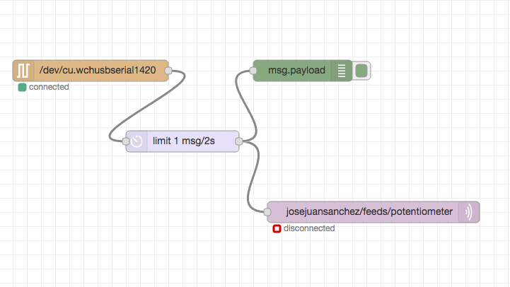
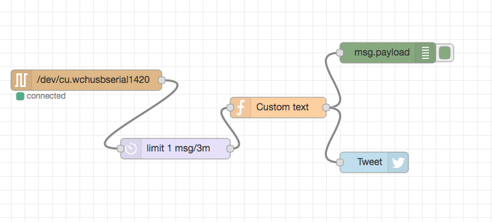

# NanoPlayBoard-Node-Red

## Example 0. How to send potentiometer values through serial port

* Upload [this sketch](00-potentiometer/arduino/read/read.ino) on your NanoPlayBoard.
* Start Node-Red from your terminal with: `$ node-red`
* Import [this flow](00-potentiometer/node-red/flow.json).

## Example 1. How to send potentiometer values to Adafruit IO using MQTT

* Upload [this sketch](01-potentiometer-mqtt/arduino/read/read.ino) on your NanoPlayBoard.
* Start Node-Red from your terminal with: `$ node-red`
* Import [this flow](01-potentiometer-mqtt/node-red/flow.json).
* The Adafruit IO dashboard is available [here](https://io.adafruit.com/josejuansanchez/nanoplayboard).

### Connection details

* **Host**: io.adafruit.com
* **Port**: 1883 or 8883 (for SSL encrypted connection)
* **Username**: your Adafruit account username (see the accounts.adafruit.com page here to find yours)
* **Password**: your Adafruit IO key (click the AIO Key button on a dashboard to find the key)
* **Topic**: (username)/feeds/(feed name or key)
* **QoS Levels**: Adafruit IO MQTT API supports QoS level 0 (at most once) and 1 (at least once) only.
* **Rate Limit**: 2 requests per second (or 120 requests within 60 seconds).
* [Reference](https://learn.adafruit.com/adafruit-io/mqtt-api).

## Example 2. How to publish weather data via Twitter

* Upload [this sketch](02-temperature-twitter/arduino/readTemperature/readTemperature.ino) on your NanoPlayBoard.
* Start Node-Red from your terminal with: `$ node-red`
* Import [this flow](02-temperature-twitter/node-red/flow.json).

